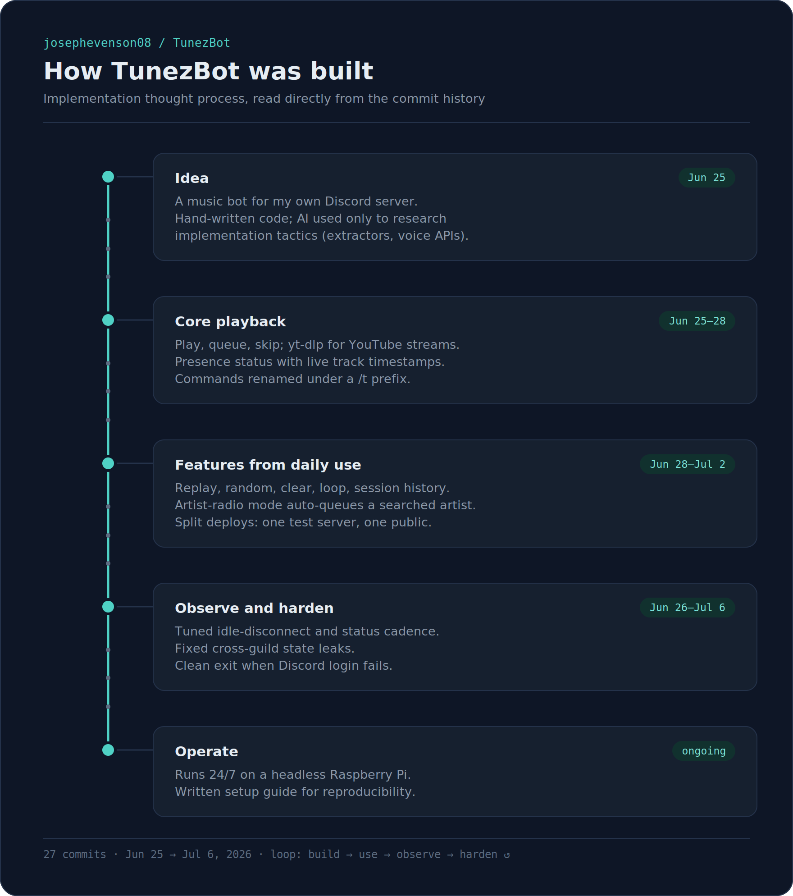

# TunezBot — Process Map

*A living record of the reasoning behind this project's decisions, kept alongside the commit history. Appended to as the project evolves — later entries build on earlier ones instead of replacing them. This is the "why," not the changelog; `git log` already has the "what."*

The build phase — idea through core playback, daily-use features, hardening, and the initial plan to run on a Pi — is mapped visually in [`tunezbot-process-map.png`](tunezbot-process-map.png):



This document picks the story up from there, in text instead of image form so it can keep growing. It also folds in what used to be a separate `AWS_HOSTING_POSTMORTEM.md` — one all-in-one record instead of several scattered ones.

---

## Hosting reconsidered: Pi vs. a cloud VM

**Jul 2026**

Before buying any Pi hardware, revisited whether a cloud VM would actually be the better call — the concern being that a Pi depends on home power and internet staying up, while a cloud VM doesn't. First candidate was Oracle Cloud's Always Free tier: a permanently free ARM VM, no hardware purchase needed. Wrote a full setup guide for it.

Reconsidered again in favor of AWS EC2 shortly after, mainly for being a more standard/recognizable platform. Rewrote the guide around AWS's free tier, and flagged upfront that AWS's free tier is time-limited (12 months from account creation) rather than free forever like Oracle's — a real cost difference worth knowing going in, not just a technical one.

## The AWS attempt — what happened and why it got reverted

**Jul 2026 — reverted**

*(This section is what used to be the standalone `AWS_HOSTING_POSTMORTEM.md`.)*

**What was set up:** EC2 `t3.micro`, Ubuntu 24.04, free-tier eligible, Node via `nvm`, `ffmpeg` via `apt`, bot cloned straight from GitHub. All of this worked exactly as expected — login, slash command registration, voice connection, no issues.

**The problem:** the first real test, `/tplay never gonna give you up`, failed:

```
NoResultError: Could not extract stream for this track
  code: 'ERR_NO_RESULT'
```

**Investigating it:**

1. Ran the bot's yt-dlp-based stream logic directly against a known video URL on the VM — it worked, returning a valid stream URL. So the IP wasn't blanket-blocked.
2. Tested `/tplay` with a direct YouTube URL instead of search text — that worked too. This isolated the failure to the *search* step specifically.
3. Traced it: `discord-player-youtubei`'s built-in search goes through `youtubei.js`'s Innertube API (YouTube's internal client), a separate code path from the yt-dlp stream fetch. Innertube's search/metadata endpoints are a more heavily bot-detection-guarded surface than a raw video download, and AWS/GCP/Azure/DigitalOcean IP ranges are widely documented as flagged by that system.
4. Ruled out stale dependencies — both `discord-player-youtubei` and the bundled `yt-dlp` binary were already on the latest available versions.

**First fix:** rerouted plain-text search (`/tplay`, `/tqueue`, `/tartist`, `/trelated`) through yt-dlp's own `ytsearch` instead of the extractor's Innertube search, since yt-dlp's extraction was proven to work from this IP. Verified the resolved URLs were correct. Deployed — searches sometimes worked, but failures kept recurring inconsistently, so a retry-once-after-a-short-delay wrapper was added around every `player.play()` call to absorb transient failures.

**What the data actually showed**, after both fixes:

- Direct YouTube URL via `/tplay`: succeeded 3 for 3, including right after search-based failures.
- Plain-text search via `/tplay`, with retry: failed on multiple different songs — including one that failed on *both* the initial attempt and the retry, for a URL that yt-dlp had just resolved correctly moments earlier.

The consistent difference wasn't which video got picked — it was that the search path fires one extra automated request at YouTube (the yt-dlp search call) immediately before the metadata and stream requests. That was apparently enough to trip something the two-request direct-URL path didn't. That's a request-volume/IP-reputation problem, not a logic bug, and no further code change was going to reliably fix it.

**Decision:** since typing a search phrase — not pasting a raw URL — is how the bot is actually meant to be used, and the instability traced back to AWS's IP range rather than anything fixable in code, moved hosting back to a Raspberry Pi on a home network. Residential ISP IPs aren't subject to the same datacenter-range bot-detection.

**Kept vs. reverted:** kept the yt-dlp-based search and the retry wrapper in `index.js` — neither is AWS-specific, and both replace a fragile beta-quality search dependency with a more mature one, which should hold up at least as well on a residential IP. Reverted AWS as the host: the EC2 instance was terminated, `AWS_SETUP.md` was removed, `RASPBERRY_PI_SETUP.md` came back with a short note on *why* Pi over cloud, so it doesn't get relitigated from scratch later.

**Status at time of writing:** Pi hardware not yet purchased; the setup guide is ready for when it is.

## Landing page + static hosting

**Jul 2026**

Built a standalone landing page for the repo, aimed more at showing it off than at pure utility — a "DJ booth console" visual identity (ink-navy ground, warm tape-deck amber, phosphor-teal oscilloscope accent, monospace display type) rather than a generic SaaS template, grounded in the bot's real commands and setup steps pulled straight from the README instead of placeholder copy. Shipped first as a Claude Artifact for quick iteration, then packaged as a real standalone `site/index.html` (self-contained, no build step) and deployed via Cloudflare Drop.

## Could the bot itself run somewhere like Cloudflare?

**Jul 2026**

Asked whether the bot could be hosted the same way as the landing page. Answer: no. TunezBot holds open a persistent Discord Gateway WebSocket and a live voice/UDP audio stream, and shells out to real `ffmpeg`/`yt-dlp` binaries as child processes — none of which fits a request-response serverless model like Cloudflare Workers or Pages. Cloudflare Containers can run genuinely persistent processes, but that platform is built around scaling workloads across regions on demand, not "keep exactly one singleton alive forever" — using it here would trade a free Pi for a more complex, likely paid setup with no real upside. Confirmed: the landing page and the bot are two separate hosting problems, and only one of them fits a platform like Cloudflare.

---

*Next entry goes here when the next decision gets made.*
