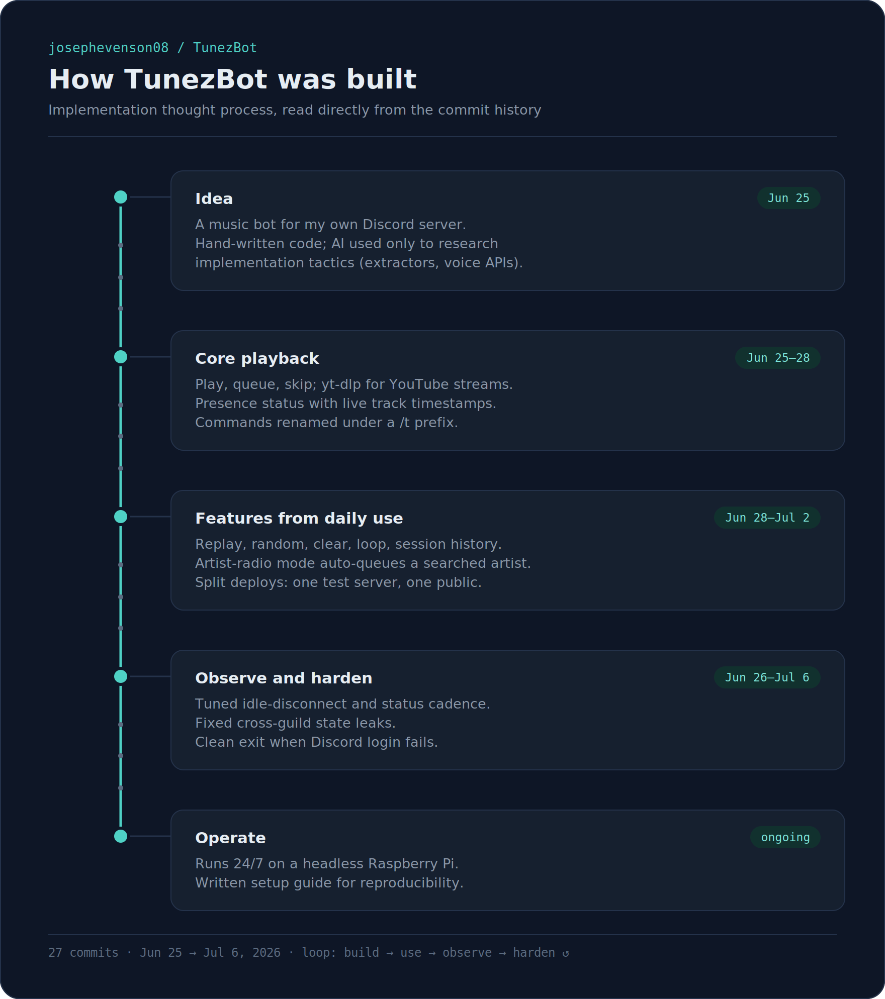

# TunezBot — Process Map

*A living record of the reasoning behind this project's decisions, kept alongside the commit history. Appended to as the project evolves — later entries build on earlier ones instead of replacing them. This is the "why," not the changelog; `git log` already has the "what."*

The build phase — idea through core playback, daily-use features, hardening, and the initial plan to run on a Pi — is mapped visually in [`tunezbot-process-map.png`](tunezbot-process-map.png):



This document picks the story up from there, in text instead of image form so it can keep growing. It also folds in what used to be a separate `AWS_HOSTING_POSTMORTEM.md` — one all-in-one record instead of several scattered ones.

---

## Hosting reconsidered: Pi vs. a cloud VM

**Jul 2026**

Before buying any Pi hardware, revisited whether a cloud VM would actually be the better call — the concern being that a Pi depends on home power and internet staying up, while a cloud VM doesn't. First candidate was Oracle Cloud's Always Free tier: a permanently free ARM VM, no hardware purchase needed. Wrote a full setup guide for it.

Reconsidered again in favor of AWS EC2 shortly after, mainly for being a more standard/recognizable platform. Rewrote the guide around AWS's free tier, and flagged upfront that AWS's free tier is time-limited (12 months from account creation) rather than free forever like Oracle's — a real cost difference worth knowing going in, not just a technical one.

## The AWS attempt — what happened and why it got reverted

**Jul 2026 — reverted**

*(This section is what used to be the standalone `AWS_HOSTING_POSTMORTEM.md`.)*

**What was set up:** EC2 `t3.micro`, Ubuntu 24.04, free-tier eligible, Node via `nvm`, `ffmpeg` via `apt`, bot cloned straight from GitHub. All of this worked exactly as expected — login, slash command registration, voice connection, no issues.

**The problem:** the first real test, `/tplay never gonna give you up`, failed:

```
NoResultError: Could not extract stream for this track
  code: 'ERR_NO_RESULT'
```

**Investigating it:**

1. Ran the bot's yt-dlp-based stream logic directly against a known video URL on the VM — it worked, returning a valid stream URL. So the IP wasn't blanket-blocked.
2. Tested `/tplay` with a direct YouTube URL instead of search text — that worked too. This isolated the failure to the *search* step specifically.
3. Traced it: `discord-player-youtubei`'s built-in search goes through `youtubei.js`'s Innertube API (YouTube's internal client), a separate code path from the yt-dlp stream fetch. Innertube's search/metadata endpoints are a more heavily bot-detection-guarded surface than a raw video download, and AWS/GCP/Azure/DigitalOcean IP ranges are widely documented as flagged by that system.
4. Ruled out stale dependencies — both `discord-player-youtubei` and the bundled `yt-dlp` binary were already on the latest available versions.

**First fix:** rerouted plain-text search (`/tplay`, `/tqueue`, `/tartist`, `/trelated`) through yt-dlp's own `ytsearch` instead of the extractor's Innertube search, since yt-dlp's extraction was proven to work from this IP. Verified the resolved URLs were correct. Deployed — searches sometimes worked, but failures kept recurring inconsistently, so a retry-once-after-a-short-delay wrapper was added around every `player.play()` call to absorb transient failures.

**What the data actually showed**, after both fixes:

- Direct YouTube URL via `/tplay`: succeeded 3 for 3, including right after search-based failures.
- Plain-text search via `/tplay`, with retry: failed on multiple different songs — including one that failed on *both* the initial attempt and the retry, for a URL that yt-dlp had just resolved correctly moments earlier.

The consistent difference wasn't which video got picked — it was that the search path fires one extra automated request at YouTube (the yt-dlp search call) immediately before the metadata and stream requests. That was apparently enough to trip something the two-request direct-URL path didn't. That's a request-volume/IP-reputation problem, not a logic bug, and no further code change was going to reliably fix it.

**Decision:** since typing a search phrase — not pasting a raw URL — is how the bot is actually meant to be used, and the instability traced back to AWS's IP range rather than anything fixable in code, moved hosting back to a Raspberry Pi on a home network. Residential ISP IPs aren't subject to the same datacenter-range bot-detection.

**Kept vs. reverted:** kept the yt-dlp-based search and the retry wrapper in `index.js` — neither is AWS-specific, and both replace a fragile beta-quality search dependency with a more mature one, which should hold up at least as well on a residential IP. Reverted AWS as the host: the EC2 instance was terminated, `AWS_SETUP.md` was removed, `RASPBERRY_PI_SETUP.md` came back with a short note on *why* Pi over cloud, so it doesn't get relitigated from scratch later.

**Status at time of writing:** Pi hardware not yet purchased; the setup guide is ready for when it is.

**Update, Aug 14 2026:** the Pi is now built, deployed and hosting the bot, and the theory above has been confirmed by measurement rather than reasoning. The same plain-text search that failed repeatedly on EC2 succeeded on the Pi on four different queries in a row, first try each time. See the August 14 entry.

## Landing page + static hosting

**Jul 2026**

Built a standalone landing page for the repo, aimed more at showing it off than at pure utility — a "DJ booth console" visual identity (ink-navy ground, warm tape-deck amber, phosphor-teal oscilloscope accent, monospace display type) rather than a generic SaaS template, grounded in the bot's real commands and setup steps pulled straight from the README instead of placeholder copy. Shipped first as a Claude Artifact for quick iteration, then packaged as a real standalone `site/index.html` (self-contained, no build step) and deployed via Cloudflare Drop.

## Could the bot itself run somewhere like Cloudflare?

**Jul 2026**

Asked whether the bot could be hosted the same way as the landing page. Answer: no. TunezBot holds open a persistent Discord Gateway WebSocket and a live voice/UDP audio stream, and shells out to real `ffmpeg`/`yt-dlp` binaries as child processes — none of which fits a request-response serverless model like Cloudflare Workers or Pages. Cloudflare Containers can run genuinely persistent processes, but that platform is built around scaling workloads across regions on demand, not "keep exactly one singleton alive forever" — using it here would trade a free Pi for a more complex, likely paid setup with no real upside. Confirmed: the landing page and the bot are two separate hosting problems, and only one of them fits a platform like Cloudflare.

---

**Late July 2026**
Got the parts ordered from pishop.usa, list of which is in the Raspberry pi setup file. Cleaned up wording format as well as cleaned up entire project environment. Deleted the generated site html file after revisiting what the purpose of this project was, and that is to review and refresh on this process of making a project, not generating content. once i have a outline of what i want the site to look like, which will bring people to the TunezBot repo, i will upload it here so that i can show what my thought process was, most likely it will be a word document paired with a sketch picture of the schematic of the website.
- plans going forward for the rest of july are as follows, 1. revisit the tunezbot code and make sure comments are up to date. 2. make sure that I have planned out what I want the html site to look like and have it uploaded to the github before i start. 3. update the raspberry_pi_setup as I do the setup once the parts get in. 4. testing launch setup for connection of raspberry pi to the tunezbot code import. 5. keep adding to this file to show thought process.

**July 27**
- started updating the Raspberry pi setup file when I got my parts delivered. Got as far as I could on a different internet position. I cleaned and wrote the SD card, assembled the case and inserted the written SD card into the board. Also was able to get a successful turn on. Had to stop when i got to the SSH position of transferring files over to the raspberry pi board when I was not on my own internet. 
- This includes the first 11 steps in the Raspberry_Pi_Setup document.
- Going forward: once I am back on my own internet I will continue the project and update the setup file accordingly.
- Also researched the safest shutdown method once i had the pi up and running and the line i learned was  "sudo shutdown -h now".

**July 28 comment and code revamp in index.js up to LOC 53**
- .env.example — added a comment telling setup users to fill in their own info; noted the file will be blank on pull so secrets stay out of git.
- index.js — revamped the comment on pulling DISCORD_TOKEN from .env.example.
- index.js — added a comment on the DISCORD_TOKEN presence check.
- index.js — reworded "unhandled" → "unknown" for the rejection handler, and revamped the comment to explain the console log behavior on unknown errors.
- index.js — expanded the comment on Discord client creation to explain how GatewayIntentBits are used.
- index.js — added a comment on the per-guild state maps, clarifying instances don't share state.
- index.js — revamped the comment on the play-history array creation (getSessionHistory).
- index.js — added a "leave-off marker" comment noting where you paused the comment-revision pass for 7/28.
- assets/pixilart-drawing.png — added a new bot icon concept drawn in external software.
- Finally, of course, reviewed everything again to make sure i did it correctly including this documentation here.

**July 29 comment and code revamp in index.js, LOC 55 to 111**
- index.js — explained the yt-dlp media extraction (LOC 55-63), and what the trimming, whitespace conversion and newline split are doing (LOC 65-66).
- index.js — explained getting the guild ID, pulling the history from the array, and appending the track to the end of it (LOC 73-76).
- index.js — noted that the queued track shows in Discord instantly and does not wait on the 3 second timer (LOC 78), plus what the interval itself updates every 3 seconds including the progress bar (LOC 85).
- index.js — explained the youtube playlist handling, the report of how many tracks were added, and why a failed message send must not crash the bot (LOC 89-92).
- index.js — explained artist mode continuation, its repeated nature, the error logging to console, and what happens when the search cannot find another song by that artist (LOC 98-111).
- index.js — added a second leave-off marker at LOC 112 for the 7/29 stopping point.
- The comments are shifting toward saying *why* a line exists instead of restating what it does. A comment that repeats the code is worse than no comment, because now two things have to stay in sync instead of one.

**July 30 — comment pass, from the LOC 112 marker into the command handlers**
- index.js — commented /tstopartist.
- index.js — commented /tloop and /tstoploop.
- index.js — commented /tskip, then its sub-paths: the catch, what gets shown, and the fallbacks.
- index.js — commented /treplay: what the function does, the catch block, the string showing what is played, and the error handling.
- Still left for next time: /trandom through /trelated, the utility functions, and the login call at the bottom.

**August 14 — built the site and a thought network, then finally got the Pi hosting the bot**

Obsidian vault, in TunezBot-Brain/:
- Built the map of the project as a linked note network instead of a single document — 65 notes, one idea each, roughly 566 links between them. Open the folder as a vault and the graph view is the picture of it.
- Split into Maps (the five hubs), Concepts (the 20 moving parts), Commands (one per slash command), Decisions (the reasoning, with the losing option kept in), Hosting, Timeline and Reference.
- The reason for doing this before the site: the site is a presentation of the thinking, and it is much easier to present thinking that has already been laid out. Writing the map first meant the site copy came out of real notes instead of being invented while writing the page.
- This file stays the canonical narrative. The vault is the same reasoning arranged so it can be walked through by subject rather than by date.

Landing page, in site/:
- Built it for real this time as three static files — index.html, styles.css, script.js. Self-contained, no build step, no dependencies, drops straight onto Cloudflare.
- Pulled the visual direction from three sites I like: Nothing for the technical labelling and dot-matrix type, Blizzard's World of Warcraft page for the cinematic dark hero and section rhythm, shirtz.cool for the marquee and the motion. Landed on the DJ booth console idea — ink navy, the Discord blurple out of the bot's own avatar, tape deck amber, phosphor teal.
- The hero wordmark is an actual dot matrix: the text is drawn to an offscreen canvas, sampled on a grid, and every lit cell becomes a dot driven by a travelling wave and the mouse.
- The centrepiece is a simulated Discord session running the real commands. The booth clock ticks every second while the bot's presence line updates every 3, because that is what the bot actually does.
- Everything on the page comes from the real README, the real commands and the real hosting story. No placeholder marketing copy, which was the whole complaint that got the first version deleted.

Found a real bug while reading index.js to write all this:
- LOC 19 registers `process.on('unknownRejection')`. Node only ever emits `unhandledRejection`, so that handler can never fire and an unhandled promise rejection now logs nothing at all.
- This came from the 7/28 change where I reworded "unhandled" to "unknown". The intent was to reword the *message*, but the *event name* got changed with it. The log line and the comment can keep saying "unknown"; the event string has to go back to `unhandledRejection`.
- Worth remembering as a category: renaming for readability is safe on your own words and unsafe on names an API owns. Nothing failed loudly here — the handler just quietly stopped existing, which is exactly the kind of change a comment pass is supposed to catch rather than cause.

### The Pi deployment, same day

Back on my own internet, so the SSH step that blocked this on July 27 finally worked. Steps 12 through 18 are written up properly in `RASPBERRY_PI_SETUP.md`; this is the part worth remembering rather than the part worth following.

**The AWS theory held up, and now it is measured instead of argued.** The single question this whole hosting detour was about: does plain-text search work from a residential IP? Ran the bot's own `searchYoutube` path from the Pi against four different queries. Four for four, first try each, no retries. On EC2 that same path failed repeatedly on different songs, including one that failed on both the attempt and the retry. That section of this document used to end on a well-reasoned theory. It now ends on evidence, and that is a much better place for it to sit.

**Four separate failures stood between "it logged in" and "I can hear it", and each one hid the next.** That is the real lesson of the day. I kept thinking I was one fix away and I was four.

1. **npm 11 does not run install scripts by default.** `npm install` reported success while `ffmpeg-static` and `youtube-dl-exec` never ran the scripts that download their binaries. A bot that installs cleanly and has no yt-dlp.
2. **No Opus encoder anywhere in the dependency list.** `@discordjs/voice` cannot encode audio without one and `package.json` never had one. It worked on Windows, so it was invisible until a clean machine. The native encoder will not build on ARM64 with Node 24 — no prebuilt binary, and the source build dies on an ARM NEON compile error — so the pure-JS `opusscript` it is.
3. **`ffmpeg-static` cannot resolve hostnames.** A statically linked glibc binary cannot use NSS, which is how glibc does DNS. That ffmpeg decodes local files perfectly and cannot open a single URL. The system ffmpeg from apt works, which is what `FFMPEG_PATH` in `.env` is for.
4. **YouTube guards playback URLs with a JavaScript challenge.** yt-dlp needs a JS engine to solve it and only enables deno by default. Without one it falls back to a client whose URLs only work for yt-dlp's own headers, so ffmpeg gets a 403. Node was already installed, so `jsRuntimes: 'node'` was the whole fix.

**Every one of failures 2, 3 and 4 presented identically: the bot announced the track, then "Queue finished" immediately, with silence and nothing at all in the terminal.** Three unrelated causes, one symptom, no error message. What actually broke the deadlock was running the pipeline by hand outside the bot — resolve a URL with yt-dlp, hand it to ffmpeg, watch what it says. The bot swallowed the error; the command line printed it.

**`noWarnings: true` cost more than it saved.** yt-dlp had been printing *"No supported JavaScript runtime could be found... extraction without a JS runtime has been deprecated"* on every single call, and `createYoutubeStream` was explicitly telling it not to show that. The message that explained failure 4 was being suppressed by an option I added to keep the output tidy. Only saw it because I ran yt-dlp manually.

**Confirmed the `unknownRejection` bug the hard way.** First live `/tplay` arrived expired — Discord gives 3 seconds to acknowledge a command and I had typed it before the bot finished logging in. `deferReply` rejected, and because that handler was registered under an event name Node never emits, the rejection escalated to an uncaught exception and the process exited. One mistyped command took the whole bot offline. Fixing the event name was not enough on its own, because a rejected promise from an async listener does not reliably reach that handler anyway — discord.js routes it through the client's `error` event. So the router is now a named function with a `.catch()` attached at registration. Catch the error where it happens instead of guessing which global handler it lands in.

**Then systemd, which is the actual difference between running and hosted.** `Restart=always` plus `enable` means crash, power cut and reboot all recover on their own with nobody logged in. Three lines in that unit file are load-bearing and all three are documented in the setup guide, `WorkingDirectory` most of all — without it systemd starts in `/`, dotenv finds no `.env`, and the bot cannot log in.

**Where this leaves the project.** The thing works, on hardware in this house, with no terminal open. `PROCESS_MAP.md` has said "Pi hardware not yet purchased" since July. It does not anymore.

**Verified with a power cut**, which is the test that actually matters. Unplugged the Pi, plugged it back in, waited two minutes, ran `/tplay` without touching a keyboard, and the song played. Nothing logged into, nothing started by hand. That one test exercises every line of the systemd unit at once — `enable` starting it at boot with nobody logged in, `After=network-online.target` making it wait for the network rather than failing to reach Discord, and `WorkingDirectory` meaning dotenv still finds `.env` on a cold boot. Any one of those wrong and the bot would be quietly offline until the next time somebody wanted music, which is the worst way to find out.

That is the actual end of the arc that started with "should this run on a Pi or a cloud VM". The answer was a Pi, for a reason nobody would have guessed at the start — not cost, not learning, but the IP address.

### Correction to the four failures above, written later the same day

I wrote that section too early, while the bot was working. It stopped working again half an hour later, and two of the four "fixes" turned out to be wrong. Leaving the original text above and correcting it here, because the mistakes are the useful part.

**Failure 3 was real, the fix was not.** `ffmpeg-static` genuinely cannot resolve hostnames — a statically linked glibc binary cannot use NSS. But `FFMPEG_PATH=/usr/bin/ffmpeg` does nothing, because prism-media looks for `ffmpeg-static` first and never reads that variable. One line would have caught it:

```
FFMPEG_PATH env: /usr/bin/ffmpeg
actually using: node_modules/ffmpeg-static/ffmpeg
```

The bot ran on the broken binary for hours while I believed that was solved. **Setting a config value is not the same as the program reading it.**

**Failure 4 was a misdiagnosis.** `jsRuntimes: 'node'` never reached yt-dlp — `youtube-dl-exec` does not pass that flag through. Asking for the same URL with and without the option returned the same client (`ANDROID_VR`) both times, so that commit changed nothing. The 403 was almost certainly a symptom of the DNS fault below.

**The real cause of most of the day was DNS.** Every uncached lookup took exactly 5.029 seconds — the glibc resolver timeout. Each query is fast alone (v4 0.063s, v6 0.022s) and stalls when sent together, because glibc sends A and AAAA in parallel on one socket and this router mishandles it. Discord gives 3 seconds to acknowledge a command, so `deferReply` was dead before its request left the Pi. Voice endpoints too, which is where the `AbortError` came from. `single-request-reopen` took lookups from 5.029s to 0.041s.

**How I should have found it faster.** I chased five hypotheses — clock skew, IPv6 latency, opusscript CPU, stale connection state, YouTube's JS challenge — and measured each one, which was right. What I did badly was *believing a fix worked because the symptom went away*. The symptom went away because a cache was warm. Every "it works now" today was followed by "it stopped again", and each time I attributed the recovery to whatever I had just changed rather than verifying the mechanism.

The instrumentation is what finally broke it open: logging how old an interaction was on arrival versus at failure (`110ms old on arrival, 5351ms by failure`) turned "somewhere in these three seconds" into "the outbound request takes five seconds", and 5.029 is a number with exactly one meaning.

### Where it actually stands

Working: audio plays, DNS is fixed, the bot survives errors instead of exiting, systemd brings it back from a power cut.

Not working: the **second** voice connection in a session. First `/tplay` plays; a later one aborts in `discord-voip` waiting for the connection to become Ready. `/tplay` deletes the existing queue, which drops the voice connection, then immediately rejoins — that teardown-and-rejoin is the next thing to investigate.

Not yet done: removing `ffmpeg-static` from `package.json`. The Pi is currently running on a symlink in `node_modules` that `npm install` will silently undo.

### August 14, later — finished it

Picked this back up and got the bot actually working, not "working until you use it twice".

**Removed `ffmpeg-static` from the project.** Its Linux build is statically linked, and a statically linked glibc binary cannot use NSS, so it cannot resolve a hostname — it decodes local files perfectly and cannot open a single URL, which is the only thing this bot ever asks of it. `FFMPEG_PATH` is not a way around that, because prism-media looks for `ffmpeg-static` first and never reads the variable. So the only fix is not having the package. ffmpeg is now a real setup step (`apt install ffmpeg`, `winget install ffmpeg`) on both machines, with the reasoning written into the README so nobody deletes that line later thinking it is redundant. This also closed a trap — the Pi had been running on a symlink inside `node_modules` that the next `npm install` would have silently undone.

**The bot was leaving the voice channel and rejoining on every `/tplay`.** I spotted this by watching Discord rather than the logs. `/tplay` deleted the queue to rebuild it, and `queue.delete()` triggers `leaveOnStop`, which drops the voice connection — and the immediate rejoin was what kept timing out as `AbortError` from `discord-voip`. That had been the mystery error all day and it was self-inflicted.

**Then `/tplay` played the wrong song.** Fixed the disconnect by inserting the new track at the front and skipping to it — except `insertTrack(track, 0)` appends rather than inserting at position 0, so the skip landed on whatever was already queued. Play A, queue B, `/tplay` C, get B.

The right answer was `node.play(track, { queue: false })` — "play this now, do not queue it" — which is exactly what the command means, and which `/trandom` in the same file has been doing correctly since it was written. **The answer was already in the codebase.**

**One experiment that failed, and it reframes the AWS postmortem.** I tried deleting the `createStream` override on the theory that it was only ever an AWS workaround, and that the extractor's own `youtubei.js` path would be fine from a residential IP. It would also have saved the 5–9 seconds of Python startup that yt-dlp costs per track. It does not work: every track came back `NoResultError` / `ERR_NO_RESULT` — **the same error the AWS attempt hit.**

That is worth sitting with. The AWS section above treats that error as evidence about IP ranges. It is not only that: the extractor's built-in streaming is broken here too, on a residential connection, for its own reasons. The yt-dlp override was load-bearing all along and I had it filed as a workaround. It is now commented in the code so nobody removes it again on the same reasoning I did.

**Still unsolved: yt-dlp costs 5–9 seconds per track.** Measured properly this time — 5.7s by hand, 9.4s inside the bot, and `--extractor-args` variants only got it to 5.1s because the cost is Python starting up on a slow ARM core, not the network. It is no longer fatal now that nothing is racing it, but it is the ugliest thing left in the pipeline.

### What I keep getting wrong, which is the actual lesson from today

Three times in one day I assumed an API did what its name suggested, and shipped a "fix" without checking:

- `FFMPEG_PATH` — prism-media never reads it
- `jsRuntimes: 'node'` — `youtube-dl-exec` never passes it through
- `insertTrack(track, 0)` — appends instead of inserting at index 0

Each was verifiable in one command. `FFmpeg.getInfo().command` prints which binary is used. Asking for the same URL with and without a flag shows whether the flag did anything. Playing a queued song shows where a track landed. I wrote three commits claiming fixes that changed nothing or changed the wrong thing.

The pattern behind it: **I believed a fix worked because the symptom went away.** Half the time the symptom went away because a DNS cache was warm. Every "it works now" today was followed by "it stopped again."

What actually moved things forward, without exception, was measurement — `5.029s`, `110ms on arrival / 5351ms by failure`, `9404ms`, `ANDROID_VR` twice — and one observation that came from watching the bot instead of the logs: it was leaving the voice channel.

Still open:
- Finish the comment pass — /trandom through /trelated, the utility functions, and login.
- `deferReply` sits outside the try block in seven handlers. The router-level catch stops the crash, but those handlers still cannot tell the user their command died.
- 7 npm audit warnings, deliberately left alone until the bot had run properly at least once.
- Deploy the landing page to Cloudflare.
